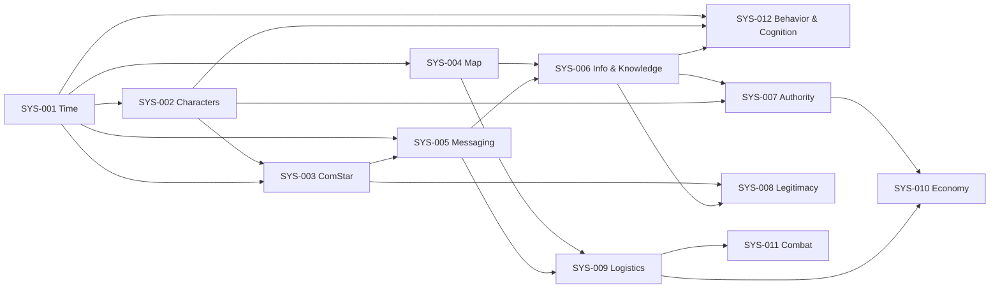

# Architecture

A snapshot of the design as tracked in the
["BattleTech (Project)"](https://docs.google.com/spreadsheets/d/13PdRUOw80mngycq1RmD7VFDo58wmkKCnNIbgo52r1Nk/edit)
spreadsheet. Update both when the design changes.

## Pillars

The simulation is constrained by six non-negotiable design pillars:

1. **Time is authoritative** — the sim clock (`SIM_TIME_TICKS`) is the single
   source of order. Every event is timestamped; nothing happens "outside" time.
2. **Information is imperfect** — no character has a god view. What a character
   knows is a function of what events they've been told about, by whom, when,
   and through which channel.
3. **Power decays with distance** — authority, reputation, and information all
   weaken with travel time. A faction's command in Terra ≠ command at the rim.
4. **Authority is not omniscience** — leaders give orders based on stale or
   distorted information; the gap between order and ground truth is a feature.
5. **ComStar is systemic, not villainous** — ComStar is modelled as
   infrastructure (the HPG network) with its own goals, not as a cackling
   antagonist.
6. **No system pauses the universe** — combat, politics, economics all run on
   the same clock. Players can act in parallel; nothing freezes the world.

## System index

| ID | System | Category | Status | Spec | Pri | Depends on |
|---|---|---|---|---|---|---|
| SYS-001 | Time & Simulation Clock | Foundational | Locked | SPEC-001 | P0 | — |
| SYS-002 | Universal Character System | Foundational | Locked | SPEC-002 | P0 | 001 |
| SYS-003 | ComStar Meta-Faction | Foundational | Active | SPEC-003 + SPEC-003B | P0 | 001, 002 |
| SYS-004 | Map & Navigation | Foundational | Active | SPEC-004 + SPEC-004A | P0 | 001 |
| SYS-005 | Order & Messaging | Foundational | Active | sys-005-order-transmission (v0.5 placeholder) | P0 | 001, 003 |
| SYS-006 | Information & Knowledge | Foundational | Active | SPEC-006 | P0 | 004, 005 |
| SYS-007 | Authority & Governance | Strategic | Active | SPEC-007 + SPEC-007A | P1 | 002, 006 |
| SYS-008 | Legitimacy & Reputation | Strategic | Active | SPEC-008 | P1 | 003, 006 |
| SYS-009 | Logistics & Readiness | Strategic | Planned | — | P1 | 004, 005 |
| SYS-010 | Economy | Strategic | Backlog | — | P2 | 007, 009 |
| SYS-011 | Combat Resolution | Tactical | Backlog | — | P3 | 009 |
| SYS-012 | Character Behavior & Cognition | Foundational | Active | SPEC-005 | P1 | 001, 002, 006 |
| SYS-013 | Movement & Jump | Foundational | Active | (in code) | P0 | 001, 004 |

> **Spec-numbering note:** SPEC-001..004 align 1:1 with their SYS numbers. SPEC-005 in the project tracker is **for SYS-012** (Character Behavior, Memory & Goals Layer) — *not* SYS-005. The SYS-005 spec is filed under its file path (`specs/sys-005-order-transmission.md`) without a conflicting SPEC-XXX label. SPEC-007A and SPEC-003B are companion specs.

## Play-mode specs (separate axis from the foundational system index)

These describe playable role profiles that consume the foundational systems above. They do not have their own SYS-XXX entries.

| Spec | Covers | Status |
|---|---|---|
| `play-pirate-mercenary` | Pirate band + mercenary organization play frameworks (state, transitions, UI surfaces) | v1.0 Design-Complete / Tuning-Pending |

## Open design questions

- **Q-001 (SYS-006, resolved by SPEC-006 §7 + §15-ext)** — How wrong can
  information be before players notice? Answer: numeric confidence is never
  shown. Players read qualitative tags (source, channel, staleness band,
  conflict tag, precision) and infer reliability themselves. Wrongness is
  visible in the data, not hidden — but the system never declares it
  "wrong," only "what character X believes via channel Y."
- **Q-003 (SYS-009, blocking)** — What readiness prevents instant action?
  Inspired by PTO-style queue/cooldown mechanics; spec pending.
- **Q-002 (SYS-007, deferred)** — Optimal autonomy per faction type.

## Pending actions

- ~~Write Information System Parcel (SYS-006)~~ — done (SPEC-006).
- Map Sarna data into system nodes (SYS-004) — in progress (Phase 0 work order ready).
- Define governance capacity metric (SYS-007) — partially answered by SPEC-007A §4 (placeholder).

## Sequencing

The dependency graph dictates the build order. Foundational P0 systems land
first; SYS-006 has now joined them as Active.

## Spec / discussion files

| System | Spec | Discussions |
|---|---|---|
| SYS-001 Time & Simulation Clock | [`specs/sys-001-time-simulation-clock.md`](specs/sys-001-time-simulation-clock.md) | — |
| SYS-002 Universal Character System | [`specs/sys-002-universal-character-system.md`](specs/sys-002-universal-character-system.md) | — |
| SYS-003 ComStar Meta-Faction | [`specs/sys-003-comstar-superset-admin-interface.md`](specs/sys-003-comstar-superset-admin-interface.md) (admin UI), [`specs/sys-003b-comstar-balance-engine.md`](specs/sys-003b-comstar-balance-engine.md) (balance daemon) | — |
| SYS-004 Map & Navigation | [`specs/sys-004-egocentric-relational-starmap.md`](specs/sys-004-egocentric-relational-starmap.md), [`specs/sys-004-map-core-integration.md`](specs/sys-004-map-core-integration.md) | [`discussions/sys-004-map-and-navigation.md`](discussions/sys-004-map-and-navigation.md), [`discussions/sys-004-3d-representation.md`](discussions/sys-004-3d-representation.md) |
| SYS-005 Order & Messaging | [`specs/sys-005-order-transmission.md`](specs/sys-005-order-transmission.md) | — |
| SYS-006 Information & Knowledge | [`specs/sys-006-information-knowledge.md`](specs/sys-006-information-knowledge.md) | — |
| SYS-007 Authority & Governance | [`specs/sys-007-authority-governance.md`](specs/sys-007-authority-governance.md), [`specs/sys-007a-faction-behavior-governance.md`](specs/sys-007a-faction-behavior-governance.md) | — |
| SYS-008 Legitimacy & Reputation | [`specs/sys-008-role-and-legitimacy.md`](specs/sys-008-role-and-legitimacy.md) | — |
| SYS-011 Combat Resolution | (spec pending) | [`discussions/sys-011-combat-real-time-no-graphics.md`](discussions/sys-011-combat-real-time-no-graphics.md) |
| SYS-012 Character Behavior & Cognition | [`specs/sys-012-character-behavior-cognition.md`](specs/sys-012-character-behavior-cognition.md) (= SPEC-005 in tracker) | — |
| SYS-013 Movement & Jump | (Tier 1 implementation in `apps-script/Code.gs` SYS-013 section; spec pending) | [`discussions/jump-operations.md`](discussions/jump-operations.md) |
| (Play mode) Pirate / Mercenary | [`specs/play-pirate-mercenary.md`](specs/play-pirate-mercenary.md) | — |
| (Unassigned) Jump Operations | — | [`discussions/jump-operations.md`](discussions/jump-operations.md) |
| (Unassigned) Audio worldbuilding | — | [`discussions/audio-worldbuilding.md`](discussions/audio-worldbuilding.md) |

**Lore library:** [`lore/clans-slang.md`](lore/clans-slang.md) — first entry, "Der erste Riss."

**Active work orders:** [`work-orders/sys-004-phase-0-starmap.md`](work-orders/sys-004-phase-0-starmap.md) — Phase 0 starmap + `systems_points_v0` artifact.

Project conventions (code labels, in-universe calendar): [`conventions.md`](conventions.md).

## Sources of truth

| Concern | Source |
|---|---|
| Live game state | `BattleTech (Game)` Google Sheet |
| Project tracking | `BattleTech (Project)` Google Sheet |
| Apps Script source | This repo, under `apps-script/` (populated by `clasp pull`) |
| Schema reference | This repo, `schema/tables.sql` + `schema/erd.md` |
| Design pillars + system index | This file |
