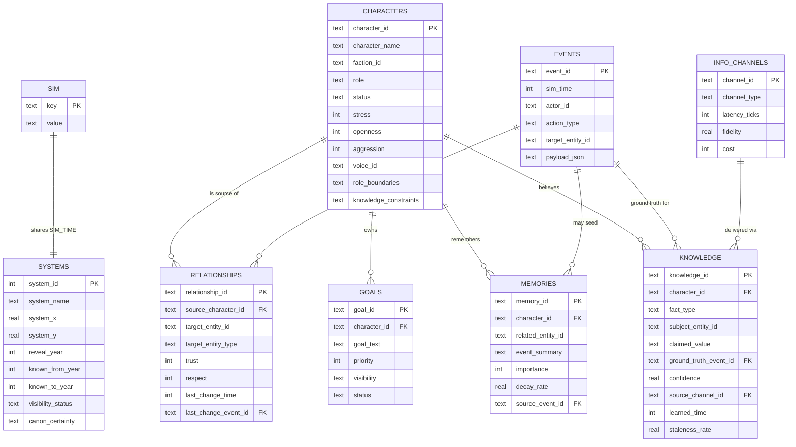

# Entity-relationship diagram

Tables in **bold** below are not yet in the live sheet — they're the SYS-006
additions documented here so the schema is unambiguous when we implement them:

- `events`, `knowledge`, `info_channels`
